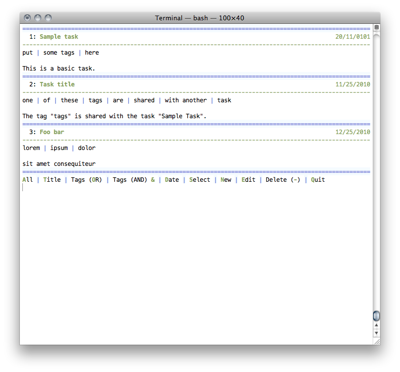

# cl_GTD

This is a command line Todo application written in PHP. The root directory contains an installer script, a directory containing some files that the installer uses, and a working demo in the Demo directory. Once you've cloned the repository (or downloaded and extracted) you can either run `./INSTALL` in the terminal to install the script as a UNIX command (so that you can run `gdt` from anywhere to start the application) or run the demo. You may have to use the `sudo` command and/or make the INSTALL file executable.

The executable file in the Demo directory is "gtd.php". Make it executable and run it and a splash screen should pop up for a second, and be replaced by the following: 

It is very visually pleasing for a text-based interface. If it looks awful in your terminal, use the terminal theme bundled in the repository.

For documentation, see the wiki. 